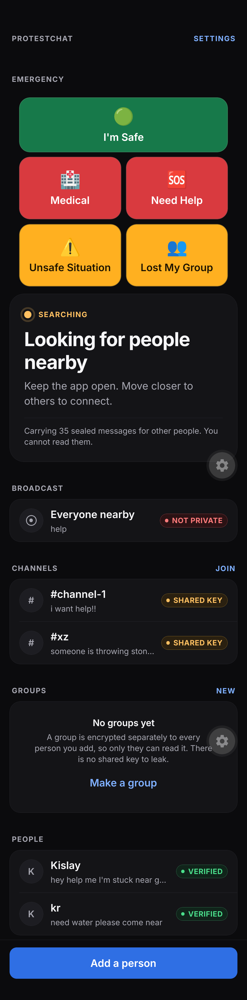

# protestchat

<p align="center">
  
</p>

<p align="center"><em>connected to a nearby phone — no internet, no tower, no server required.</em></p>

Off-grid messaging for internet shutdowns and jammed protests. Phones talk directly to each other over Bluetooth — no cell tower, no ISP, no server, no account.

**Using the app?** Start with the plain-language guide in [`website/`](website/) (Astro Starlight). Hosting the public URL is tracked in [#61](https://github.com/ni5arga/protestchat/issues/61).

Built after Delhi Police deployed portable cellular jammers at Jantar Mantar on 20 July 2026 alongside an unpublished mobile internet restriction. **Those jammers target 3G/4G/5G only.** 2.4 GHz is untouched, so two phones standing next to each other were still perfectly capable of talking — there was just no user-friendly & acessible app to do it.

## How it works

```
┌──────────────── shared TypeScript (~85%) ────────────────┐
│  UI · SQLite · sealing · dedup · relay · expiry          │
├──────────────────────────┬───────────────────────────────┤
│  Swift (iOS)             │  Kotlin (Android)             │
│  CoreBluetooth           │  BLE GATT                     │
└──────────────────────────┴───────────────────────────────┘
              BLE / Wi-Fi Direct — no tower, no ISP
```

The native layer is a **dumb byte pipe**: advertise, discover, connect, send bytes, receive bytes. It contains no chat logic, no storage, and no crypto, so there is exactly one implementation of the security-critical code to audit rather than three that drift apart.

Routing is **epidemic, not addressed**. There are no routing tables, because a routing table is a map of who talks to whom. Every phone carries every unexpired envelope it has seen and offers it to every peer it meets; the recipient is simply whoever can decrypt it. This costs battery and bandwidth and buys the property that a captured phone reveals nothing about who was talking to whom.

It also means **a phone is a courier**. Someone who walks out of a jammed zone carries queued messages with them and delivers them on the other side.

## Four ways to send

| | Who reads it | Use it for |
|---|---|---|
| **Everyone nearby** | Anyone in range, **including police running this app** | Crowd warnings: "exit blocked at gate 4" |
| **Channel** | Anyone with the passphrase | An affinity group that needs to grow by word of mouth |
| **Group** | Only the people you added | Your actual crew |
| **Direct** | One person | Everything sensitive |

Channels have **no owner, no admin, no kick** — a channel is a passphrase and nothing else. That is deliberate: BitChat's channel commands were validated only by the issuing client, so any member could seize a channel or strip its encryption. A construct with no privileged operations has none to forge. The cost is that a leaked passphrase ends the channel; start a new one.

Groups are **fan-out** — one separately sealed copy per member, no shared group key, so there is no rekeying problem and no group cryptography to get wrong. Capped at 15 people because each message costs N transmissions over a radio Google documents as low-bandwidth.

## Layout

```
src/lib/
  crypto-core.ts    sealing + channel keys — pure, no RN imports, fully tested
  crypto.ts         keystore wrapper around crypto-core
  protocol.ts       wire format, padding, expiry
  db.ts             SQLite: messages, contacts, channels, groups, envelope cache
  store.ts          MeshStore interface — lets the engine run against memory in tests
  mesh.ts           the engine — sealing, dedup, store-and-forward, relay
  transport.ts      radio abstraction (our BLE GATT today, LoRa/gateway later)
  conversation.ts   derives the mode and its warning, in ONE place
  app-state.tsx     React bindings
src/app/            home, chat/[id], add, verify/[id], join-channel, new-group, settings
modules/nearby-mesh/    the Swift + Kotlin native module
scripts/doctor.sh       checks your build toolchain and names the fix for anything missing
docs/THREAT-MODEL.md
```

`mesh.ts` takes its transport and store by injection, so the whole engine — relaying, dedup, hop limits, channels, fan-out — is exercised by `npm test` with no radio and no phone.

## Build it

**Expo Go will not work** — it cannot load custom native Bluetooth code. You need a development build, which means Xcode and/or Android Studio.

```bash
npm install
npm run doctor      # checks the toolchain, names the fix for anything missing

npm test            # 72 tests — crypto, wire format, mesh logic. No device needed.
npm run typecheck

npm run android     # Android phone over USB
npm run ios         # iPhone over USB
```

`npm run doctor` exists because the two usual blockers — `xcode-select` pointing at CommandLineTools, and Android Studio never having downloaded its SDK — both fail with errors that do not name the fix.

The first native build takes several minutes. After that JavaScript hot-reloads; Swift or Kotlin changes need a rebuild.

### Platform status

| | State |
|---|---|
| **Android** | Builds. Kotlin module compiles against `play-services-nearby`. |
| **iOS** | **Blocked.** See below. |

### Why we do not use Google Nearby Connections

The obvious choice for cross-platform device-to-device is Google's Nearby Connections. We built on it first and then removed it, for two independent reasons:

1. **On iOS it only ever brings up the Wi-Fi LAN medium** — both phones must already be joined to the same Wi-Fi network. In a jammed square with no infrastructure that is not a degraded path, it is no path at all. Google lists iOS BLE as "in development."
2. **It ships for iOS via Swift Package Manager only**, with [no CocoaPods support](https://github.com/google/nearby/issues/1685) — an open request since May 2023, filed precisely because React Native and Flutter plugin systems depend on CocoaPods.

So even solving the packaging would have produced an iPhone that cannot reach an Android phone at a protest. We now own the radio outright in `modules/ble-mesh/`: CoreBluetooth on iOS, BLE GATT on Android, no third-party dependency on either side.

The migration is an upgrade rather than a workaround. Nearby gave us no control over the advertising identifier, and a stable BLE identifier is a tracking beacon — open problem #2 in the threat model. Owning the advertisement is the only way to rotate it, which we now do every 15 minutes from fresh CSPRNG bytes, with no name or key material advertised at all.

### Permissions

`prebuild` pulls `RECORD_AUDIO`, `SYSTEM_ALERT_WINDOW` and legacy storage permissions in from Expo defaults. A protest app requesting microphone access is bad optics and real attack surface, so `app.json` blocks them via `android.blockedPermissions`. **Re-check after any `prebuild`** — run `npm run doctor` and inspect `android/app/src/main/AndroidManifest.xml` for `tools:node="remove"`.

`INTERNET` is still requested because Metro needs it in development. A release build should drop it: an app that physically cannot open a socket is a much stronger claim than one that promises not to.

## Test it — the milestone that matters

### What is automated

| Layer | Automated | How |
|---|---|---|
| Crypto, channel keys, wire format | yes | `npm test` |
| Mesh logic — relay, dedup, hop limits, fan-out, store-and-forward | yes | `npm test`, engines wired through a fake transport |
| Kotlin compiles | yes | `npm run android` (or `cd android && ./gradlew :app:assembleDebug`) |
| Swift compiles | blocked | see the iOS gap above |
| App installs and launches | yes | `npm run android` / `npm run ios` |
| **The radio actually finding a peer** | **no** | two physical phones, by hand |

**The mesh cannot be tested in a simulator or emulator.** Neither has a real Bluetooth radio — the transport will initialise and then discover nothing, forever. There is no emulator trick for this. Everything below needs two phones in the same room.

### The manual part

The whole point is one thing working, so test exactly that first.

**Setup.** Install the build on two phones (one iPhone and one Android is the interesting case). Grant the Bluetooth permissions on Android (and Location on Android 11 and below); Bluetooth on iOS. Keep the app in the **foreground** on both — background BLE is an unsolved problem, see the threat model.

**1. Cut the network for real.**

Airplane mode on both phones, then manually turn Bluetooth back on. Wi-Fi can stay off entirely — this transport is BLE only. Confirm you genuinely have no connectivity: open a browser, load anything, watch it fail.

**2. Introduce the two phones.**

- Phone A: **Add a person → My code**
- Phone B: **Add a person → Scan theirs**, point it at A's screen
- Repeat in the other direction so each has the other

Do this standing next to each other. This in-person step is the entire trust model — there is no server to vouch for anyone.

**3. Verify.**

Open the chat, tap the amber **Not verified yet** strip, and check both phones show the same 15 digits. Mark verified. If they differ, someone is in the middle.

**4. Send.**

The banner at the top of the home screen should read **Connected to 1 phone**. Send a message. It should arrive in a second or two, with no internet on either device.

**5. Now test the parts that actually matter.**

| Test | Expected |
|---|---|
| Walk out of range, send, walk back | Shows "Waiting for someone in range", then delivers on reconnect |
| Force-quit and reopen | History intact, radio comes back up on its own |
| Send while the other phone is fully off | Queues; delivers when it returns |
| Three phones, A and C never in range of each other | B relays. **This is the mesh working.** |
| Both phones join channel `gate4` with the same passphrase | Messages appear for both, with sender names |
| One phone joins `gate4` with the *wrong* passphrase | Sees nothing. It relays the traffic but cannot read it |
| Send in "Everyone nearby" | Every phone with the app sees it, contact or not |
| Make a group of 3, send once | All members receive it; non-members see nothing |
| Leave a phone idle 6 hours | Envelopes AND decrypted messages expire and disappear |
| Settings → panic wipe | Everything gone, new identity, radio back up |

Row 4 is the real proof — it is the difference between a mesh and a Bluetooth demo. Rows 5–8 cover the modes added after the first build.

The channel test worth doing deliberately: join `gate4` on two phones with the same passphrase and on a third with the *wrong* one. The third should see nothing while still relaying the traffic — that demonstrates confidentiality and relaying are genuinely independent, which is the core claim of the design.

## What is not built yet

- Background relaying (iOS suspends BLE aggressively — the biggest open problem)
- Double Ratchet / post-compromise security (per-message FS via OTKs is in for direct/group — see `docs/FORWARD-SECRECY.md`)
- Images
- Argon2id for channel passphrases (currently scrypt N=2^14, see the threat model)
- Any passphrase strength enforcement
- Synchronised group membership — your member list is local only
- Sybil / flood resistance
- Duress PIN and decoy mode
- Reproducible builds
- Any independent security audit

## Contributing

Most useful right now, in order:

1. Applied cryptographers — review the OTK/SPK FS construction (`docs/FORWARD-SECRECY.md`) and Double Ratchet feasibility under store-and-forward
2. Anyone who has shipped cross-platform BLE GATT — especially iOS peripheral role and Android OEM quirks
3. Anyone who has been in a shutdown or jammed protest — what would you actually have used?
4. Anyone who wants to co-write the threat model

Security findings get published with credit. We would much rather hear it from you than read it in a paper written after people relied on this — which is exactly what happened to Bridgefy, which protesters in Hong Kong and during the CAA protests used while it was [comprehensively broken](https://eprint.iacr.org/2021/214).

## Licence

MIT. Use it, fork it, ship it, build it into something better — no permission needed and no strings attached.

The point is that this gets into as many hands as possible. Anyone should be able to take this, rename it, and hand it to people in a shutdown without asking anyone.

One consequence worth stating plainly, since this is security software: MIT permits closed-source forks, so a modified build could ship without its source. **Only trust a build you compiled yourself, or one from a source you have reason to trust.** That is true of any app, and reproducible builds — still on the open-problems list — are what would let you verify it rather than take it on faith.
